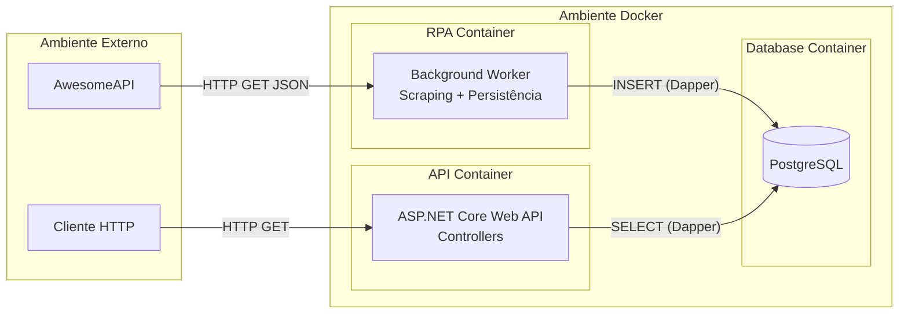
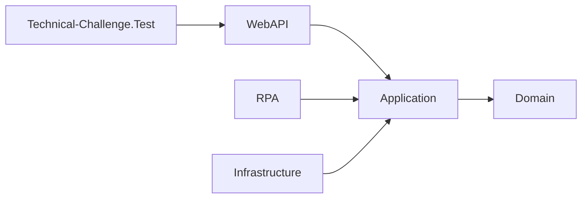

# Visão Geral

Sistema de coleta (RPA) e consulta (API) de cotações de moedas.

O Worker em background coleta dados regularmente e armazena em um banco relacional, enquanto a Web API fornece endpoints para consulta e histórico dessas cotações.

**Problema que resolve:** Permite armazenar o histórico de cotações de moedas em banco de dados local para consultas rápidas e relatórios, reduzindo chamadas repetidas e dependência de APIs externas de terceiros.

**Fonte de dados utilizada:** `https://economia.awesomeapi.com.br/json/last/USD-BRL,EUR-BRL,BTC-BRL,EUR-USD`

**Stack de tecnologias:** .NET 8.0, ASP.NET Core, Entity Framework Core (Migrações), Dapper, PostgreSQL 16, Docker, Docker Compose, Polly, Npgsql.

---

# Como Rodar o Projeto (Guia Rápido)

Esta seção é dedicada inteiramente para você rodar a stack completa do projeto com apenas alguns comandos usando **Docker Compose**.

**Pré-requisitos obrigatórios:**

- Docker instalado (e rodando)
- Docker Compose
- Git

### 1. Clonar o Repositório

```bash
git clone https://github.com/FeJoestar18/Technical-Challenge.git

cd Technical-Challenge
```

### 2. Subir os Containers (API + RPA + Banco + pgAdmin)

Este comando fará o build das imagens .NET (via multi-stage Dockerfiles), inicializará o banco de dados e rodará as migrações automaticamente no startup.

O comando `docker compose up --build -d` inicia todos os serviços definidos em `compose.yaml` de uma vez: `api`, `rpa`, `db` e `pgadmin`.

```bash
docker compose up --build -d
```

### 3. Acessos Disponíveis

Após os containers subirem e o healthcheck do banco (`pg_isready`) liberar a API, os seguintes acessos estarão disponíveis:

- **Documentação da API (Swagger):** [http://localhost:8080/swagger](http://localhost:8080/swagger)

- **Painel do Banco de Dados (pgAdmin):** [http://localhost:5050](http://localhost:5050)
- **Email:** `admin@admin.com`
- **Senha:** `admin123`
- **Banco PostgreSQL local:** `localhost:5433` (mapeado externamente para evitar conflitos com PostgreSQL já em execução na porta `5432`).

### 4. Comandos Administrativos (Opcionais)

Caso você precise visualizar logs, desligar o ambiente ou limpar os dados para começar do zero:

```bash
# Visualizar logs da API e do RPA rodando em background
docker compose logs -f api rpa

# Parar todos os serviços
docker compose down

# Parar serviços e DESTRUIR o volume de dados (exclui todo o histórico do banco)
docker compose down -v
```

---

# System Design



**Visão geral do fluxo:**

- O container `rpa` coleta cotações externas e grava os dados no PostgreSQL.
- O container `api` consome esse banco e expõe os resultados pela Web API.
- O container `db` armazena o histórico de cotações usado por ambos.

**Principais decisões:**

- `Technical-Challenge.RPA` e `Technical-Challenge.WebAPI` são hosts separados para manter isolamento de responsabilidade.
- A camada `Application` é compartilhada entre os dois hosts, garantindo reutilização de regras de negócio.
- O PostgreSQL roda em container próprio com volume persistente `postgres_data`.
- `pgadmin` existe só como ferramenta de inspeção e não é parte do fluxo de negócios.

**Resiliência:**

- `docker compose` usa `depends_on` com healthcheck para aguardar o banco antes de iniciar `api` e `rpa`.
- O scraping usa `HttpClientFactory` + Polly com retry exponencial e circuit breaker.
- `restart: on-failure` em `api` e `rpa`, e `restart: always` em `db`, ajudam a recuperar de falhas transitórias.

---

# Arquitetura do Projeto

**Padrão arquitetural adotado:** Clean Architecture / Layered Architecture.

### Dependências do projeto



- `Domain`: regras de negócio e entidades puras (`CurrencyQuote`, `User`).
- `Application`: contratos e orquestração do fluxo de scraping, incluindo o `Worker`.
- `Infrastructure`: implementa os contratos, lida com persistência, scraping HTTP e configuração de banco.
- `WebAPI`: host HTTP, controllers, Swagger, DI e execução da API.
- `RPA`: host separado que inicia o `Worker` e executa a coleta de forma autônoma.
- `Technical-Challenge.Test`: projeto de testes que referencia `WebAPI` para validar os componentes e a configuração de DI.

### Pontos chave

- `Application` é a camada central: independente de frameworks e compartilhada por `WebAPI` e `RPA`.
- `Infrastructure` fornece implementações concretas e integrações externas usadas pela camada de aplicação.
- `WebAPI` e `RPA` são dois hosts distintos, evitando acoplamento de runtime.
- O projeto de testes (`Technical-Challenge.Test`) funciona sobre `WebAPI`, garantindo cobertura de regressão sem dependências diretas extras.

**Princípios aplicados:**

- SRP: cada classe tem responsabilidade única.
- DIP: componentes dependem de interfaces, não de implementações concretas.
- Single Source of Truth: configuração e acesso a dados são centralizados em `Infrastructure`.

---

# O que eu melhoraria se tivesse mais tempo

- Extrair um barramento de mensagens para desacoplar coleta e persistência, usando Kafka ou RabbitMQ.
- Adicionar cache de leitura com Redis para reduzir latência do endpoint e reduzir carga no banco.
- Evoluir para microserviços maduros, separando `Worker`, `API` e futura camada de consulta/reports.
- Incluir observabilidade completa com métricas, tracing distribuído e logs estruturados.
- Acrescentar testes de integração end-to-end cobrindo fluxo `Worker -> DB -> API`.
- Implementar deploy canary e feature flags para reduzir risco em mudanças de produção.
- Melhorar o fallback de scraping para suportar mudanças inesperadas na estrutura da API externa.

---

# Arquitetura de Pastas

```text
.
├── compose.yaml                            ← Orquestração dos containers (db, api, pgadmin)
├── .env                                    ← Variáveis de ambiente padrão
├── Technical-Challenge.Domain/
│   ├── Entities/
│   │   ├── CurrencyQuote.cs                ← Entidade principal das cotações
│   │   └── User.cs                         ← Entidade de usuário
├── Technical-Challenge.Application/
│   ├── Interfaces/
│   │   ├── IQuoteRepository.cs             ← Contrato de acesso a dados
│   │   └── IScraperService.cs              ← Contrato de scraping
│   └── Worker.cs                           ← Loop do robô RPA (BackgroundService)
├── Technical-Challenge.Infrastructure/
│   ├── Persistence/
│   │   └── Context/
│   │       └── AppDbContext.cs             ← Configuração do EF Core e mapeamento do schema
│   ├── Repositories/
│   │   └── QuoteRepository.cs              ← Implementação de repositório usando Dapper
│   ├── Services/
│   │   └── HttpScraperService.cs           ← Fetch na API externa + mapeamento JSON
│   └── Migrations/                         ← Histórico de migrações do Entity Framework Core
├── Technical-Challenge.WebAPI/
│   ├── Controllers/
│   │   └── QuotesController.cs             ← Endpoints HTTP da API de consulta
│   ├── Extensions/
│   │   ├── ApplicationBuilderExtensions.cs ← Middlewares e execução das migrações
│   │   └── ServiceCollectionExtensions.cs  ← Configuração de DI e API
│   ├── Dockerfile                          ← Receita multi-stage build do container
│   ├── Program.cs                          ← Ponto de entrada e composição raiz
│   └── appsettings.json                    ← Configurações e definições base da aplicação
├── Technical-Challenge.RPA/
│   ├── Dockerfile                          ← Receita multi-stage build do container de RPA
│   ├── Program.cs                          ← Ponto de entrada do serviço de scraping
│   └── Technical-Challenge.RPA.csproj      ← Projeto de serviço em background
└── Technical-Challenge.Test/               ← Projeto de testes unitários (Worker e Scraper)
```

**Separação entre os projetos:**
O projeto agora utiliza uma separação física clara entre o serviço de RPA (`Technical-Challenge.RPA`) e a API (`Technical-Challenge.WebAPI`).

- `Technical-Challenge.RPA` é um projeto executável em background que roda o `Worker` e faz o scraping periódico.
- `Technical-Challenge.WebAPI` é um serviço HTTP separado que expõe os dados coletados.
- `Technical-Challenge.Application` contém a lógica de orquestração e contratos reutilizados por ambos os hosts.
- `Technical-Challenge.Infrastructure` fornece persistência, scraping HTTP e suporte de banco para os dois hosts.

---

# Design Patterns Utilizados

| Pattern                         | Onde                                               | Por quê                                                         | Benefício                                                                         |
| ------------------------------- | -------------------------------------------------- | --------------------------------------------------------------- | --------------------------------------------------------------------------------- |
| **Repository Pattern**          | `QuoteRepository.cs` e `IQuoteRepository.cs`       | Isolar a lógica de acesso a dados do domínio e aplicação.       | Facilita testes unitários e a troca de tecnologias de persistência.               |
| **Dependency Injection**        | `ServiceCollectionExtensions.cs`, `Program.cs`     | Fornecer as instâncias concretas para as interfaces injetadas.  | Baixo acoplamento; inversão de dependências eficiente.                            |
| **Background Service / Worker** | `Worker.cs` (`IHostedService`)                     | Executar tarefas repetitivas de scraping em segundo plano.      | Integração nativa ao ciclo de vida da API com suporte a `CancellationToken`.      |
| **Retry Pattern (Polly)**       | `ServiceCollectionExtensions.cs`                   | Lidar com instabilidades da requisição HTTP à AwesomeAPI.       | Resiliência automática (não falha o sistema na primeira lentidão).                |
| **Circuit Breaker (Polly)**     | `ServiceCollectionExtensions.cs`                   | Evitar sobrecarga em caso de falha contínua da API externa.     | Protege a aplicação de travar esperando timeouts repetidos da API fora do ar.     |
| **Options Pattern**             | `appsettings.json`, `Worker.cs`                    | Centralizar e mapear configurações dinâmicas de infraestrutura. | Alteração de variáveis (`Scraper:IntervalMinutes`) sem necessidade de recompilar. |
| **Factory**                     | `ServiceCollectionExtensions.cs` (`AddHttpClient`) | Gerar `HttpClient` controlado pelo ciclo de vida da API.        | Evita problemas conhecidos de socket exhaustion no framework.                     |

---

# Serviços e Componentes

### RPA — Worker Service

- **O que é e papel:** Um orquestrador configurado como `BackgroundService` (.NET Hosted Service) que executa o processo de scraping de forma intermitente.
- **Como o loop funciona:** Opera num laço infinito `while (!stoppingToken.IsCancellationRequested)`. Utiliza o método assíncrono `Task.Delay` com o tempo configurado em `_intervalMinutes` para pausar entre execuções sem bloquear threads.
- **Como trata falhas:** Usa um bloco `try/catch` tratando exceções `HttpRequestException` e `Exception` genérica. Em caso de falha, ele apenas efetua o registro (`_logger.LogError`) e adormece novamente até o próximo ciclo.
- **Ciclo de vida no Docker:** O container possui a flag de política de reinício `restart: on-failure`, que garante um boot seguro se o serviço falhar de forma irrecuperável.

### Scraper Service

- **URL alvo e moedas:** `https://economia.awesomeapi.com.br/json/last/USD-BRL,EUR-BRL,BTC-BRL,EUR-USD`.
- **Mapeamento:** O JSON possui campos dinâmicos onde não é possível um map direto para tipos estritos. O componente utiliza `JsonDocument.Parse` para enumerar os objetos root, extraindo códigos, e utiliza `decimal.Parse(raw, CultureInfo.InvariantCulture)` para montar as instâncias de `CurrencyQuote`.
- **Configuração HttpClient:** Injetado via Factory, é envelopado pelas políticas do Polly definidas na `ServiceCollection` (Retry exponencial 3x e Circuit breaker após 5 erros).

### Repository — RPA e API

- **Interface e implementação:** Contrato `IQuoteRepository` implementado integralmente por `QuoteRepository` utilizando o micro-ORM **Dapper**.
- **Injeção de connection string:** A classe importa o `IConfiguration`, extraindo a chave `DefaultConnection` para a criação da instância transitória de `NpgsqlConnection`.
- **Query SQL (INSERT RPA):**
  ```sql
  INSERT INTO quotes (currency, bid, ask, high, low, captured_at)
  VALUES (@Currency, @Bid, @Ask, @High, @Low, @CapturedAt)
  ```
- **Queries SQL (SELECT API):**
  - Todas: `SELECT id AS "Id", currency AS "Currency"... FROM quotes ORDER BY captured_at DESC LIMIT @PageSize OFFSET @Offset`
  - Mais recentes: `SELECT DISTINCT ON (currency) ... FROM quotes ORDER BY currency, captured_at DESC`
  - Por Moeda: `... WHERE UPPER(currency) = UPPER(@Currency) ORDER BY captured_at DESC`

### Database Initializer

- **Quando roda:** Rodado automaticamente no startup da aplicação (`Program.cs`) chamando `app.InitializeDatabaseAsync()`.
- **O que faz (SQL):** Diferente de um script manual `.sql`, o sistema utiliza migrações baseadas no EF Core (`efContext.Database.MigrateAsync()`). Ele executa internamente o CREATE TABLE `quotes` contendo os tipos reais e configurados pelo `AppDbContext` (`id`, `currency`, `bid numeric(18,6)`, `ask numeric(18,6)`, `captured_at timestamptz DEFAULT NOW()`).
- **Indexes criados:** Cria os índices reais `idx_quotes_currency` para performance de consultas baseadas em moeda e `idx_quotes_captured_at` de forma descendente para ordenação de histórico.

### Web API e Controllers

- **Configuração da API e Versionamento:** O projeto ASP.NET possui suporte a versionamento de API configurado no `ServiceCollectionExtensions.cs` (`AddApiVersioning`). Ele suporta tanto a rota default (`/api/quotes`) quanto a rota explícita de versão (`/api/v1/quotes`). O Swagger está configurado para exibir essa documentação, e o CORS permite qualquer origem/método.
- **Porta:** Exposta para rede hospedeira no Docker pela porta `8080`.
- **Tabela de Endpoints:**

| Controller | Método | Rota                        | Descrição                                | Query params       | Retorno                      |
| ---------- | ------ | --------------------------- | ---------------------------------------- | ------------------ | ---------------------------- |
| **Quotes** | GET    | `/api/v1/quotes`            | Lista todas as cotações com paginação    | `page`, `pageSize` | `200 OK` (`IEnumerable`)     |
| **Quotes** | GET    | `/api/v1/quotes/latest`     | Última cotação de cada moeda             | -                  | `200 OK` (`IEnumerable`)     |
| **Quotes** | GET    | `/api/v1/quotes/{currency}` | Histórico de uma moeda específica        | -                  | `200 OK` (`IEnumerable`)     |
| **Quotes** | GET    | `/api/v1/quotes/range`      | Cotações em um intervalo de datas        | `from`, `to`       | `200 OK` ou `400 BadRequest` |
| **Test**   | GET    | `/Test`                     | Endpoint simples de verificação de saúde | -                  | `200 OK` (`string`)          |

_(Nota: O controller `Quotes` também atende pela rota legada `/api/quotes` que assume a versão default 1.0)_

---

# Fluxos do Sistema

### Fluxo de Coleta (RPA)

1. Worker acorda após intervalo configurado via variável (`Scraper:IntervalMinutes`).
2. Chama o método do contrato `IScraperService.FetchQuotesAsync()`.
3. O HttpClient injetado faz o `GET` na fonte externa (com retry automático do Polly caso ocorram falhas de conexão/timeout).
4. O JSON retornado é desserializado via `JsonDocument` e mapeado para uma `List<CurrencyQuote>`.
5. O método chama `IQuoteRepository.SaveAsync(quotes)`.
6. O Dapper abre a conexão e executa a query real de `INSERT` no PostgreSQL iterando sobre as entidades da lista.
7. O Worker gera um log transacional informando o sucesso e quantidade e adormece novamente.
8. Em caso de falha: a exceção é capturada, loga o erro em console, não lança a exceção abortando o app, e retoma o processo no próximo ciclo.

### Fluxo de Consulta (API)

1. Cliente HTTP faz uma requisição GET num endpoint exposto da `QuotesController`.
2. Controller recebe a requisição, valida queries (como o `range` de datas) e chama um método da `IQuoteRepository`.
3. Dapper executa a query `SELECT` específica (ex: com filtro `WHERE UPPER(currency) = UPPER(@Currency)`) de forma parametrizada no banco PostgreSQL.
4. Os dados recuperados são devolvidos ao controller, que repassa para o framework que os serializa para JSON e responde com `200 OK`.
5. Se não encontrado: o retorno consiste em uma coleção vazia `[]` com código `200 OK`.

### Fluxo de Inicialização (Docker Compose)

1. O Compose levanta a stack de rede e processa a criação do container `db` (PostgreSQL).
2. O healthcheck configurado dispara comandos `pg_isready` internamente, e os containers dependentes aguardam.
3. Após o banco estar "healthy", os demais containers (`api` e `pgadmin`) que possuem a condição `depends_on` se ativam.
4. A API sobe e dispara o `DatabaseInitializer` que executa as migrações (EF Core), criando a tabela de cotações caso ainda não exista no banco.
5. O Worker BackgroundService é despachado, iniciando seu primeiro ciclo assíncrono de coleta.
6. Em paralelo, a API já está pronta para receber e despachar requisições do Swagger ou clientes externos na porta 8080.

---

# Banco de Dados

**Schema da tabela `quotes`:**

- `id`: `integer` (PK, Auto Increment)
- `currency`: `varchar(20)` (Not Null)
- `bid`: `numeric(18,6)` (Not Null)
- `ask`: `numeric(18,6)` (Not Null)
- `high`: `numeric(18,6)` (Nullable)
- `low`: `numeric(18,6)` (Nullable)
- `captured_at`: `timestamp with time zone` (Not Null, Default: `NOW()`)

**Indexes e justificativas:**

- `idx_quotes_currency`: Criado para otimizar as operações do endpoint `/api/quotes/{currency}` que filtram grandes volumes de linhas textualmente.
- `idx_quotes_captured_at`: Auxilia imensamente a velocidade das requisições de paginação e relatórios de data range, ordenando a listagem de forma descendente.

**Acesso direto via Docker CLI:**

```bash
docker exec -it postgres_db psql -U postgres -d challenge
```

---

# Docker e Infraestrutura

- **docker-compose.yml:** Define a orquestração multi-container. `db` utiliza a imagem Alpine do PostgreSQL 16; `api` monta o projeto .NET local expondo a porta `8080`; `rpa` inicia a coleta em background com o mesmo código de aplicação, isolado da API; e `pgadmin` é configurado na porta `5050` como painel do BD.
- **Multi-stage build (Dockerfile):** Utiliza um padrão de múltiplas fases. A fase `build` possui ferramentas (SDK do .NET 8.0) para restaurar as dependências e compilar o código de todos os módulos de classe. A fase `runtime` (`aspnet:8.0`) pega apenas os binários finais gerados no publish. Isso garante que a imagem final possua menor tamanho de disco (reduz overhead) e remove vulnerabilidades e utilitários que não devem estar em produção.
- **Volume pgdata:** Definido globalmente e atrelado ao `/var/lib/postgresql/data`. O PostgreSQL escreve as modificações nele. Esse mecanismo retém e resguarda os dados se o container morrer ou for removido.
- **Healthcheck e Impacto no Startup:** O healthcheck atesta se o PostgreSQL aceita comandos (via `pg_isready`). Essa proteção de bloqueio impede que a Web API ou o Worker subam simultaneamente e falhem tentando criar conexões em um servidor de banco de dados inativo ou ainda em processo de warm-up.

---

# Variáveis de Ambiente

As configurações são definidas globalmente no arquivo `.env` (que o Docker Compose carrega) e as variáveis de aplicação no `appsettings.json` ou sobrescritas pelo Env.

| Variável                               | Serviço | Default             | Descrição                                        |
| -------------------------------------- | ------- | ------------------- | ------------------------------------------------ |
| `POSTGRES_DB`                          | db      | challenge           | Nome base do banco criado                        |
| `POSTGRES_USER`                        | db      | postgres            | Usuário administrador do DB                      |
| `POSTGRES_PASSWORD`                    | db      | 123456              | Senha do usuário administrador                   |
| `PGADMIN_DEFAULT_EMAIL`                | pgadmin | admin@admin.com     | Email de acesso do painel                        |
| `PGADMIN_DEFAULT_PASSWORD`             | pgadmin | admin123            | Senha de acesso do painel                        |
| `ConnectionStrings__DefaultConnection` | api     | Host=db;...         | URL baseada para o EntityFramework e Dapper      |
| `Scraper__IntervalMinutes`             | api     | 5                   | Periodicidade das chamadas da API externa em min |
| `Scraper__TargetUrl`                   | api     | https://economia... | Endereço com moedas requisitadas (AwesomeAPI)    |
| `ASPNETCORE_ENVIRONMENT`               | api     | Production          | Controla variáveis internas do ASP.NET           |

---

# Decisões Técnicas

- **PostgreSQL ao invés de SQLite:** A escolha de um SGDB server-side maduro visa dar suporte a conexões concorrentes geradas de um lado pelo Worker inserindo dados incessantemente, e do outro por múltiplos clientes executando leituras na API de forma estável. Trata-se de uma stack verdadeira "production-ready".
- **Dapper ao invés de EF Core (para queries e persistência diária):** Foi escolhido focar o Entity Framework unicamente nas migrações e configuração do schema. Ao processar volumes massivos em um Worker, ou expor listas numa API, o Dapper brilha na performance pura removendo o forte overhead de Change Tracking do Entity Framework, dando controle total aos comandos SQL.
- **Worker Service ao invés de Hosted Service manual ou Console separado:** Aderir ao `BackgroundService` permite aproveitar integralmente a Injeção de Dependências já montada da WebAPI e o `ILogger`. O CancellationToken nativo encerra o robô de forma graciosa sem abortar tarefas no meio de gravações.
- **Polly para resiliência:** O uso de Retry com backoff e Circuit Breaker retira a complexidade declarativa do código de negócio. Mantém a resiliência configurada no HTTP pipeline (`AddHttpClient`), evitando a poluição visual do projeto principal.
- **Multi-stage Dockerfile:** Gera uma imagem compacta focada apenas nos pacotes runtime, diminuindo os riscos com a superfície de ataque e aprimorando o uso de recursos no servidor.
